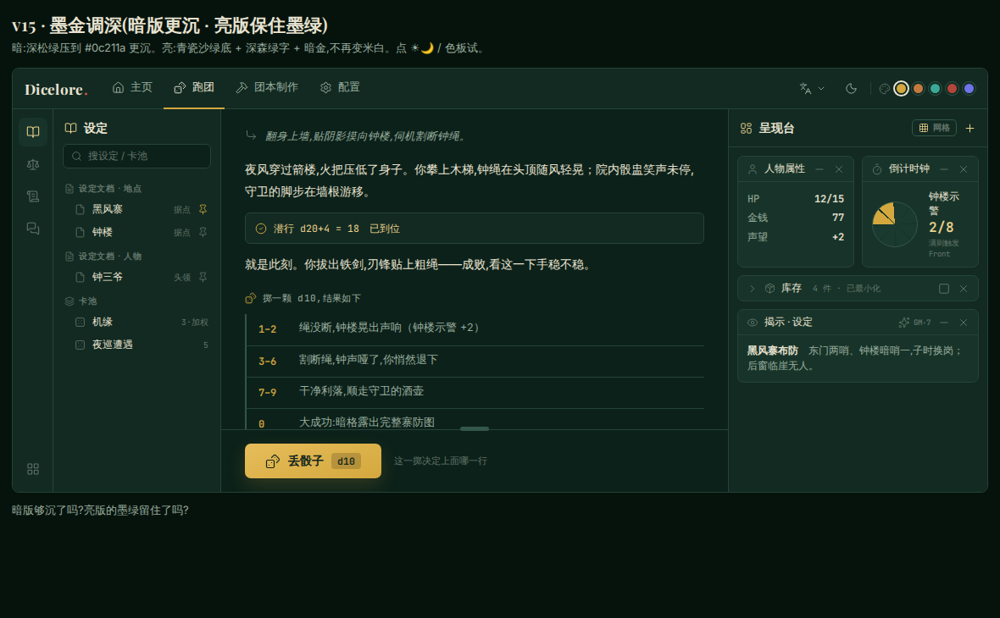
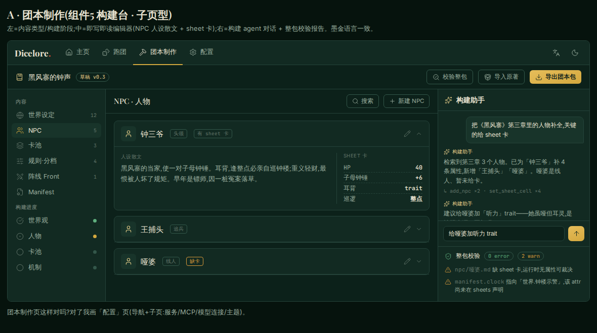
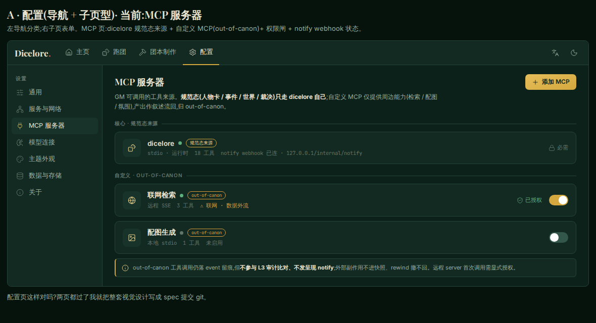

<p align="right"><a href="README.md">English</a> · <strong>简体中文</strong></p>

<p align="center">
  
</p>

<p align="center"><strong><em>A rose without thorns is too perfect to be true.</em></strong></p>

> 「虚拟太完美了，像一朵没有味道也没有刺的玫瑰。」

<p align="center">一个 agentic 的文字冒险游戏平台——让 AI 当一个尊重骰子、不讨好玩家的主持人。</p>

---

## 这是什么 · What is Dicelore?

**Dicelore** 是一个可对接多 agent、多 model 的前后端交互界面（开发中），加一套跑团特化的 agent 套件。这套 agent 把 AI 调教成尊重骰子、不一味讨好玩家的游戏主持人：权威游戏状态被锁在 AI 改不动的地方，骰子真正决定成败，让文字冒险游戏重新拥有真实的对抗与后果。

它服务两类人——想**玩**文字冒险游戏的玩家，和想**写**文字冒险剧本的作者。

---

## 为什么会有它 · Why

> 「虚拟太完美了，像一朵没有味道也没有刺的玫瑰。」

这句话来自一位朋友，它点出了一个真实的问题：用 AI 玩文字冒险游戏，玩久了往往会腻——因为 AI 太想讨好玩家。它表现为三种失败：

- **F1 跳骰**：该掷骰定胜负时，直接编一个对玩家有利的结果；
- **F2 软着陆**：骰出了坏结果，又偷偷给玩家圆回来；
- **F3 替玩家做主**：该玩家自己拿主意时，它替你定了。

当玩家知道无论怎么选都不会真的输，风险感随之消失，游戏也就退化成了爽文。

这不是某一款产品的失误，而是「提示词」这套范式的固有局限：游戏状态保存在 AI 生成的文本里，它可以随时改写，没有什么能拦住它；世界书和规则堆得再多，也无法阻止它在关键时刻手下留情。

Dicelore 的答案是 **agent 架构**——把 AI 关进一个它无法篡改的世界。权威游戏状态外置在 AI 够不到的 SQLite 里，分四个业务域：`sheet`（人物卡 / 库存）、`event`（剧情事件）、`world`（世界设定 / 卡池）、`rule`（版本化只读规则）；掷骰与随机由程序执行，AI 只能引用结果。在此之上用三层约束兜住失败模式：

- **L1 工具强制**：掷骰、抽随机、改状态都必须走工具，AI 绕不过去；
- **L2 塑形教条**：用一套 skill（Agenda → Principles → Moves）教它怎么当好主持人；
- **L3 审计**：事后抓违规。

| | 提示词范式 | Dicelore（agentic） |
|---|---|---|
| 状态住在哪 | AI 的输出里 | AI 够不到的 SQLite |
| 谁掷骰 / 取数 | AI 自己写个数字 | 引擎执行，AI 只给引用 |
| 加一项能力的代价 | context 变胖、token 上涨 | 多一个工具，context 不涨 |
| 防跳骰 / 软着陆 | 靠 AI 自觉 | 结构上 AI 拿不到真值 |

---

## 我们的愿景 · Our Vision

Dicelore 致力于服务两类人——想玩文字冒险游戏的玩家，以及想编写文字冒险剧本的作者，并为他们提供一个美观、优雅、现代化的界面，同时尽最大可能兼容客制化与社区生态。适配移动端是我们的长期愿景。

---

## 怎么玩 · How to play

> 目前可玩**单人文字冒险游戏**（安价形态：骰子 / 投票驱动的接龙）。

v1 规划两个玩家入口，按需选：

- **多端整合包**（安卓 / Windows 优先，macOS / Linux / iOS 随后）：一个下载内含客户端 UI + 本地后端 sidecar。填 **API key + base URL** 即玩——无需命令行、无需单起服务。*（开发中——进度见 [里程碑](docs/wiki/设计/05-现状与计划/里程碑.md)。）*
- **自托管后端 + 浏览器**：用 docker-compose 自起 `backend`（适合远程 / 多租户），浏览器走 web 客户端玩，同样填 **API key + base URL**。*（逐步指引见 [玩家指南](docs/wiki/指南/玩家指南.md)。）*

框架强制掷骰 / 给选项、维护人物卡与剧情状态，AI 据结果叙述、不软着陆。

> **新来？** 先看 **[指南](docs/wiki/指南/)**——给三类使用者的任务向走查：[**玩家指南**](docs/wiki/指南/玩家指南.md)（装·起·玩一局）· [**作者指南**](docs/wiki/指南/作者指南.md)（造团本 Adventure · DIY 自定义 MCP）· [**开发者指南**](docs/wiki/指南/开发者指南.md)（DIY 插件 · 接口规范 · 开发示例）。

> **关于 CLI**：`dicelore` CLI 是**开发 / 会话管理工具**（`new`/`list`/`inspect`/`init`），**非**玩家入口、无 `play` 命令。

---

## 有问题或建议？ · Questions or suggestions?

[`docs/wiki/`](docs/wiki/) 分两域：**[指南](docs/wiki/指南/)**（任务向，给玩家 / 作者 / 开发者）和 **[设计](docs/wiki/设计/)**（对维护者的推导链：业务 → 领域模型 → 架构 → 子系统设计 → 现状）。设计「为什么」内嵌各设计页的*决策与权衡*节（配一份薄[决策变更日志](docs/wiki/设计/决策变更日志.md)，历史记录归档）。术语单源 = 顶层[术语表](docs/wiki/术语表.md)。

有问题、建议，或想参与开发？欢迎开 [issue](../../issues)，或读 [CONTRIBUTING.md](CONTRIBUTING.md) 了解开发流程与约定。

---

## 截图 · Screenshots

> 完整独立的 web 玩家客户端（组件7）：VSCode 式可拖拽组件工作区，**「墨金」主题**（深墨绿 + 描金，可换肤 + 明暗双态 + 可选强调色）。下面是设计定稿草图（实现推进中）。



<p align="center"><sub>跑团页 · 左活动轨 · 中央叙事/打字一体 · d10 掷骰 · 右「呈现台」（网格停靠面板）· 圆形 PbtA 倒计时钟</sub></p>


<p align="center"><sub>主页 · 欢迎页 · <a href="docs/wiki/设计/04-子系统设计/玩家客户端-视觉草图/home.html">可运行草图</a></sub></p>



<p align="center"><sub>团本制作 · 构建台 · <a href="docs/wiki/设计/04-子系统设计/玩家客户端-视觉草图/build.html">可运行草图</a></sub></p>



<p align="center"><sub>配置 · MCP / 模型 / 主题 · <a href="docs/wiki/设计/04-子系统设计/玩家客户端-视觉草图/config.html">可运行草图</a></sub></p>

<p align="center"><sub>设计语言与四页 IA → <a href="docs/wiki/04-子系统设计/玩家客户端-视觉.md">玩家客户端-视觉</a></sub></p>

---

## 安装（进行中） · Installation (Progress)

> 一键安装的全栈客户端仍在开发中；当前可通过 CLI 跑起来。

```bash
npm install              # 安装依赖
npm test                 # 运行测试（vitest）
npm run typecheck        # 类型检查
npm run dicelore -- new <团名>   # CLI：建 / 开一局会话
```

会话存档在平台 app-data 目录下 `dicelore/sessions/<名字>.db`；环境变量 `DICELORE_SESSIONS_DIR` 可覆盖根目录、`DICELORE_SESSION` 指定缺省会话名。

**技术栈**：TypeScript + better-sqlite3（权威状态外置）· MCP（`@modelcontextprotocol/sdk` v1.x + Zod v3，内层能力库包成一组 `dicelore_*` 工具）· FTS5 + jieba 中文全文检索（trigram 零依赖保底）。

---

## 许可证与致谢 · License and credits

[](LICENSE)

Dicelore 采用 **GNU Affero 通用公共许可证 v3.0 或更高版本（AGPL-3.0-or-later）** 开源——见 [LICENSE](LICENSE)。

> Copyright (C) 2026 MuLeiSY2021

AGPL 的要点：任何人都可以自由使用、修改、分发；**但只要你修改了 Dicelore 并通过网络向用户提供服务（例如架设在线跑团站点），你就必须把对应的完整源码一并公开。**

**致谢**：那句「没有刺的玫瑰」来自一位朋友的随口一叹，却成了这个项目的起点。也感谢每一位贡献者——提交 PR 即表示你同意，你的贡献将以同样的 **AGPL-3.0-or-later** 授权并入。
