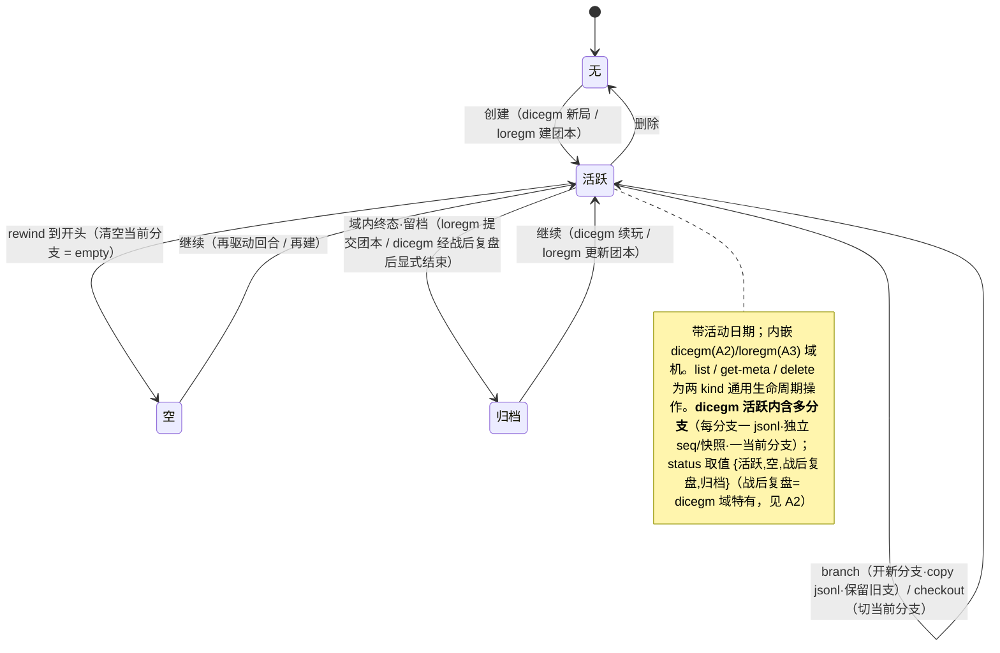
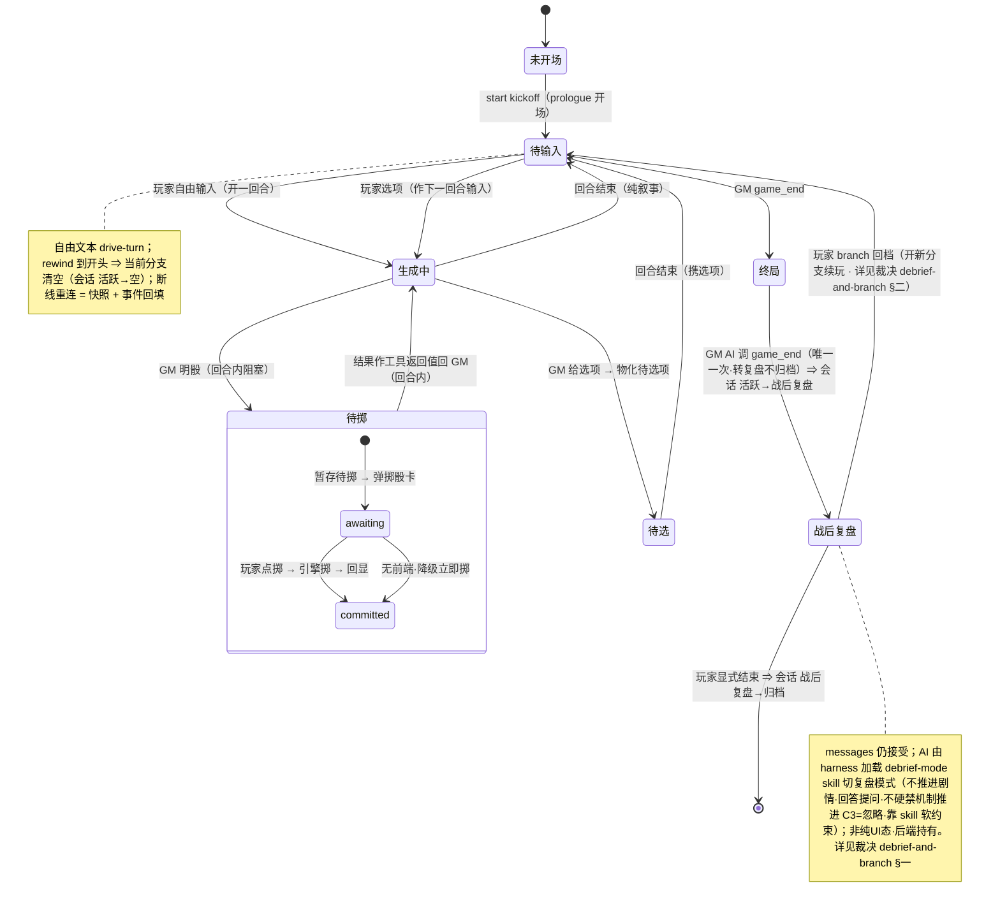
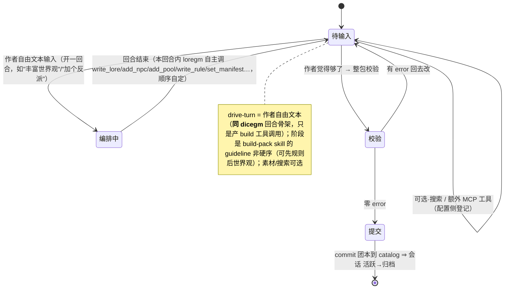
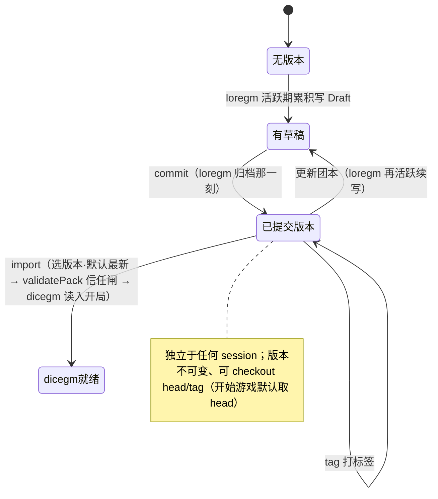
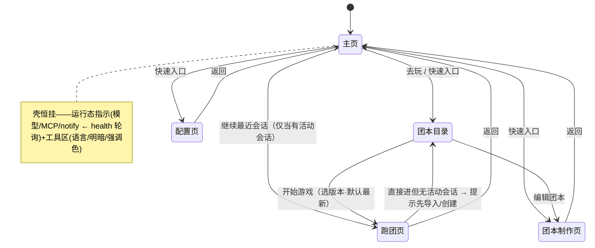
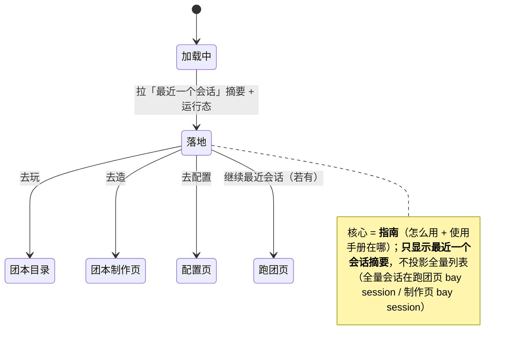
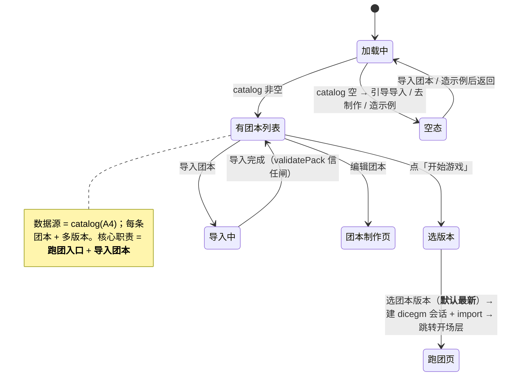
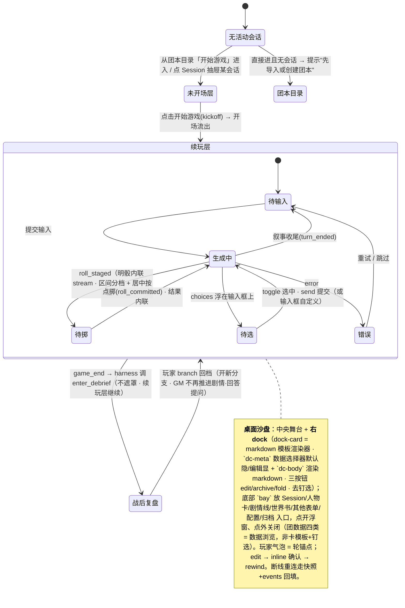
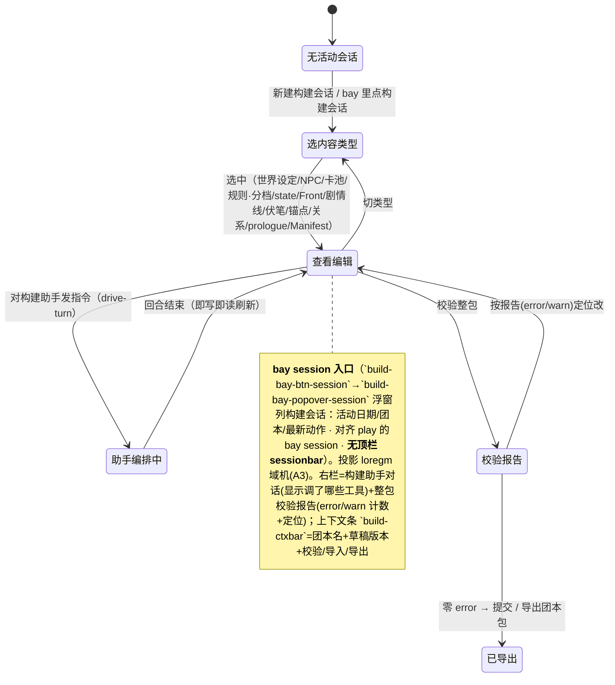
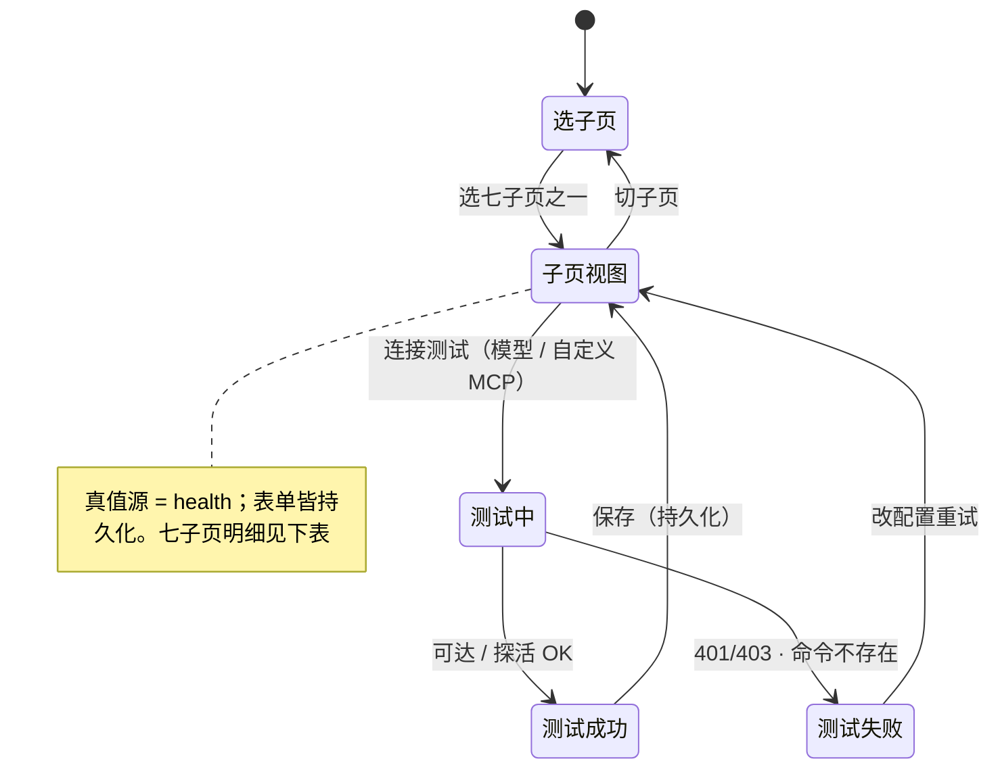

# 第零步 · 行为状态机（架构图景 = 期望规格的根）

> 属 `acceptance-loop` 第零步。**两类状态、都详建**：A 实体状态机 + B 页状态机。映射：页 DISPLAYS 实体；页状态 = 实体状态投影 + 页自身 UI 状态。建模法 → skill `references/state-machine-model.md`。
> 验收 = 用假 GM/假 loregm + curl/playwright 遍历每条转移，断言转移后可观测状态符合期望。

## 分层总览

```
A. 实体状态机（后端持有的持久实体）
   A1 会话生命周期：无 / 活跃 / 空 / 归档      [dicegm | loregm 共享骨架]
        └ 活跃内嵌域机：A2 dicegm 回合循环 / A3 loregm 自由编排
   A4 catalog 团本产物库（版本 · 独立）        loregm 写 / dicegm 读

B. 页状态机（每页一台）
   B1 导航页(壳)  B2 主页(指南+最近会话摘要)  B3 团本目录页(玩的入口)
   B4 跑团页(顶栏 bar + 回合循环)  B5 团本制作页(bay session + 自由编排)  B6 配置页(七子页)
```

---

## A. 实体状态机

### A1. 会话生命周期机（无 / 活跃 / 空 / 归档 · dicegm/loregm 共享骨架）



### A2. 域机 · dicegm 跑团回合循环（活跃内嵌）



### A3. 域机 · loregm 自由编排（活跃内嵌 · 作者自由文本驱动）



### A4. catalog 团本产物库（独立 · loregm 写 / dicegm 读）



---

## B. 页状态机（每页一台 · 投影实体 + 纯 UI）

### B1. 导航页 / 壳（导航状态 = 在哪页 + 壳级运行态）



### B2. 主页（落地页 · 指南为主 + 最近一个会话摘要）



### B3. 团本目录页（第 2 页 · 跑团入口 · 选版本 / 导入）



### B4. 跑团页（第 3 页 · 桌面沙盘 + bay 抽屉 + 投影 dicegm 域机 A2）



### B5. 团本制作页（第 4 页 · bay session + 投影 loregm 域机 A3）



### B6. 配置页（第 5 页 · 最复杂也最简单 · 七子页）

> "最复杂"=子页多、覆盖面广；"最简单"=机制统一（表单 + 持久化 + 可选连接测试），无域状态机。



**七子页明细**（来源：视觉§6 + §9.1）：

| 子页 | 内容 | 数据源 / 端点 |
|---|---|---|
| 通用 | 语言(zh/en) + 通用偏好 | localStorage |
| 服务与网络 | 主页端口 / 域名 / notify webhook(`DICELORE_NOTIFY_URL`) | health(port/notify) |
| MCP 服务器 | 核心 `dicelore`（stdio·运行时·**工具数**·notify·标「必需」锁定）+ 自定义 out-of-canon MCP（增删改 / 开关 / 权限闸 / out-of-canon 徽 / 联网警示 / 连接测试） | health(工具数) + mcp-test；**自定义 v1 未接运行时（RT8）** |
| 模型连接 | GM 模型下拉 + **Agent 底座**(Harness 默认 / Claude Agent SDK) + key 掩码 / baseURL / OAuth + 连接测试 | model-test + keys(H3) |
| 主题外观 | 主题(墨金/…) / 明暗(含跟随系统) / 强调色 / 字体档 | localStorage |
| 数据与存储 | `DICELORE_DATA_DIR`(每局一文件) / `DICELORE_FTS_MODE` 等（展示后端真值） | health(sessionsDir/ftsMode) |
| 关于 | 版本 / 许可 / 项目信息 | — |

### B↔A 映射速查

| 页状态机 | 投影的实体状态 | 页自身 UI 状态（正交） |
|---|---|---|
| B2 主页 | A1 **最近一个会话**(摘要) + health 运行态 | 指南为主·加载 |
| B3 团本目录 | A4 catalog(团本+版本) | 加载/列表/空态·选版本·导入中 |
| B4 跑团页 | A2 dicegm 域机 + A1 **全量会话**(bay session) | 无会话提示·未开场/续玩层·面板三态·重连 |
| B5 制作页 | A3 loregm 域机 + A1 **全量构建会话**(bay session) | 内容类型选择·助手·校验 |
| B6 配置页 | health / keys 真值（无会话） | 七子页·表单·测试三态 |
| B1 导航页 | A1(是否有活动会话→跑团置灰) + health(运行态) | 在哪页·工具区 |
