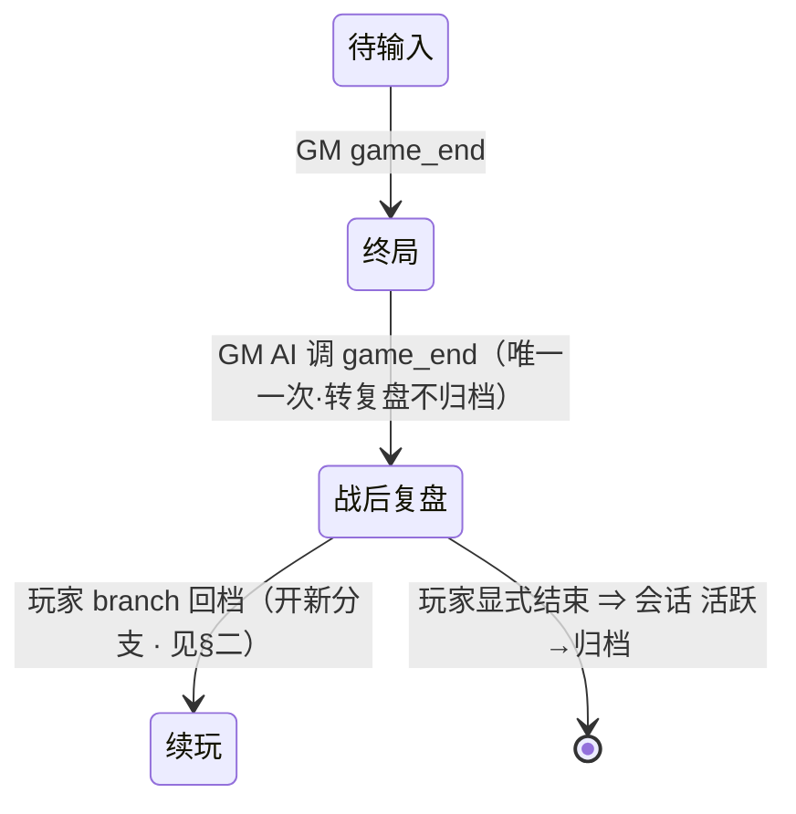

# 裁决：debrief-and-branch —— 战后复盘态 + 会话分支模型

- [x] 用户已批准本裁决

> 来源：acceptance-loop 第 1 轮（`docs/tdd/acceptance-loop-2026-07-06/`）前端大改暴露的两处状态机缺口——RT-FE7（战后复盘态）+ RT-FE8（rewind/branch 两功能）。
> 用户 2026-07-08 定调：
>
> - **复盘**：「game_end 以后，会唯一一次调用这个 mcp 使会话进入战后复盘，之后 harness 侧会加载 skill，教 ai 进入复盘模式」。
> - **分支**：「rewind 和 branch 是两个功能，rewind 是覆盖**当前分支**，branch 是新建一个分支，相当于是 copy 一个新的 jsonl」。
>   本裁决把两句定调推导到零不确定；推导点标【拟】并列入「待用户确认」。**勾批准前请逐条过【拟】项。**

---

## 一、战后复盘态（RT-FE7）

### 1. 触发链

```
GM AI 调 game_end MCP（唯一一次·现有工具）→ 后端: 会话状态 终局 → 战后复盘（不归档）
  → harness 检测 game_end → 加载 debrief-mode skill → 后续 AI 回合走复盘模式
```

- `game_end` 既是 GM AI 调用的 MCP 工具（`harness/src/dicegm/mcp/server.ts:39`·GM 决定结局），又是 §5 WS 消息（RT-B3 必验）；**复用，不新增 enter_debrief**。
- game_end 调用后**不再直接归档**，而转"战后复盘"态；幂等（已在复盘态时重复调用返回当前态、不报错）。
- 复盘态是**实体态**（非纯 UI 态）：后端持有状态、`messages` 仍接受、AI 行为由 harness skill 切换。

### 2. 复用 game_end MCP（不新增工具）

- 域：dicegm（loregm 无复盘态——作者域终态是 commit 提交团本，非复盘）。
- **复用现有 `game_end` MCP 工具**（`harness/src/dicegm/mcp/server.ts:39`），不新增 `enter_debrief`。C1 定调=`game_end(已存在)`。
- 语义变化：game_end 调用后，会话**不再直接归档**，而转"战后复盘"态（A2 终局→战后复盘）。
- 入参：game_end 现有入参（`{reason, outcome}` 等·不变）。
- 出参：game_end 现有返回 + `status: "debrief"`（标识已进复盘态）。
- 调用方：GM AI（现有·GM 决定结局）；harness 仅检测 game_end 后加载 `debrief-mode` skill，不额外调 MCP。
- 幂等：会话已在复盘态时重复调 game_end 返回当前态、不报错。

### 3. 复盘态行为

- `POST /sessions/dicegm/{id}/messages` 仍 `202 {turnId}` 接受。
- AI 行为由 harness 加载的 `debrief-mode` skill【拟·待确认 skill 名】切换：
  - **不推进剧情**、回答玩家对结局/过程/人物的提问；
  - 可调只读工具（`browse` world/rule/log）辅助回答；
  - **不硬禁止** `roll_staged` / `choices` / `game_end`（C3 定调=忽略）——靠 `debrief-mode` skill 的 prompt 软约束 AI 不推进剧情；后端不强制拦截。
- WS 消息：复盘态下的 narration 走现有 `narration_commit`；**不新增 WS 类型**（C4 定调=不需要；复盘态进入靠 `game_end` 调用语义 + GET meta `status="debrief"` 体现）。

### 4. 复盘态退出（三条）


| 退出             | 转移                     | 说明                                                                                          |
| ---------------- | ------------------------ | --------------------------------------------------------------------------------------------- |
| 玩家 branch 回档 | 战后复盘 → 续玩(新分支) | 见本裁决§二；玩家从结局点 branch 到某 seq 续玩                                               |
| 玩家显式结束     | 战后复盘 → 归档         | C5 定调=复用 `DELETE /sessions/dicegm/{id}`（不新增端点） |
| 玩家关会话       | （不变）                 | 下次进入仍在复盘态；不自动归档                                                                |

### 5. A2 状态机修正



- **删**原 `终局 --> [*] : ⇒ 会话 活跃→归档`（终局不再直接归档，必经复盘态）。
- A1 会话生命周期 `status` 取值由 `{活跃, 空, 归档}` 扩为 `{活跃, 空, 战后复盘, 归档}`。

### 6. 接口可见

- `GET /sessions/dicegm/{id}` meta：`status` 可为 `"debrief"`（game_end 调用后置位）。
- `SessionSummary`（`GET /sessions/dicegm`）：含 `status`，列表可标复盘态会话。
- **不新增** `enter_debrief` 端点/MCP——复盘态进入靠 game_end 调用语义转变（C1）。

---

## 二、会话分支模型（RT-FE8）

### 1. 模型

- 一个 dicegm session 下可有多个 **branch**，每 branch 一个 jsonl 事件日志（独立 seq、独立 presentation 快照）。
- session 创建时有一个默认 branch（C6 定调=`main`）。
- **当前分支** = session 当前活跃的 branch；所有 `messages` / `rewind` / `roll` / `choices` 操作作用于当前分支。
- 切换分支 = 切换当前分支 + 重算 presentation（=目标分支快照）。

### 2. branch 创建（新建分支 = copy 新 jsonl）


| 接口      | `POST /sessions/dicegm/{id}/branches`                                                                         |
| --------- | ------------------------------------------------------------------------------------------------------------- |
| 请求      | `{fromSeq?, name?}`                                                                                           |
| 语义      | 复制**当前分支**的 jsonl 到 `fromSeq` 截断，产生新 branch；新 branch **自动成为当前分支**（C7 定调=是）       |
| `fromSeq` | 省略 = 复制到当前分支当前 seq；指定 = 复制到该 seq（等价于"先 rewind 到 fromSeq 再开分支"，但**不改原分支**） |
| 响应      | `201 {branchId, sessionId, fromSeq, isCurrent: true}`                                                         |

> 与 rewind 的区别：rewind 改当前分支（丢弃其后事件）；branch 保留当前分支、另起一支。前端"终局复盘→分支回档"= 在复盘态调 `branches` {fromSeq} 开新分支续玩。

### 3. branch 列表 / 切换


| 接口                                                      | 请求 | 响应                                                                                  |
| --------------------------------------------------------- | ---- | ------------------------------------------------------------------------------------- |
| `GET /sessions/dicegm/{id}/branches`                      | —   | `{currentBranchId, branches: [{branchId, name, createdAt, seq, isCurrent}]}`          |
| `POST /sessions/dicegm/{id}/branches/{branchId}/checkout` | —   | `200 {branchId, presentation: PresentationSnapshot}`（切换当前分支 + 返回该分支快照） |

### 4. rewind（覆盖当前分支）

- `POST /sessions/dicegm/{id}/rewind {toSeq?}` → 在**当前分支** jsonl 上截断到 `toSeq`；**不改 branch、不新增 branch**。
- 省略 / 到头 = 当前分支清空（A1 活跃→空）。
- **dry-run 预览**（前端 inline 确认"丢弃其后 N 条"）：前端据已拉 `events`（含 seq）本地算，**零后端改动**【定调】。

### 5. A1/A2 状态机纳入分支

- A1 活跃态内嵌"当前 branch"维度；branch/checkout 转移 = 活跃→活跃（切当前 branch）。
- branch 转移 = 活跃→活跃（新分支，旧分支保留可 checkout 回去）。
- rewind 转移不变（活跃→活跃回退 / 活跃→空到头），作用域从"会话"收窄为"当前分支"。

### 6. loregm 域是否支持分支

- C8 定调=否（仅 dicegm）；loregm 作者改团本走 Draft 增量，分支试错需求弱，v1 不做。

---

## 三、待用户确认清单（勾批准前请逐条过）


| #  | 项                                                           | 推荐值                           | 你的定调         |
| -- | ------------------------------------------------------------ | -------------------------------- | ---------------- |
| C1 | 战后复盘 MCP canonical 名                                    | `enter_debrief`                  | game_end(已存在) |
| C2 | harness 加载的 skill 名                                      | `debrief-mode`                   | `debrief-mode`   |
| C3 | 复盘态是否禁止`roll_staged`/`choices`/`game_end`（机制推进） | 禁止                             | 忽略             |
| C4 | 复盘态是否需新 WS 消息`debrief_entered`                      | 不需要（靠 game_end + GET meta） | 不需要           |
| C5 | 复盘态"显式结束"用 DELETE 还是新增 POST /end                 | 复用 DELETE                      | 复用 DELETE      |
| C6 | 默认分支名                                                   | `main`                           | `main`           |
| C7 | branch 创建后新分支是否自动成当前分支                        | 是                               | 是               |
| C8 | loregm 域 v1 是否也支持 branch                               | 否（仅 dicegm）                  | 否（仅 dicegm）  |

---

## 验收

- **战后复盘**：假 GM 走完一局调 `game_end` MCP → curl 验后端状态变 `debrief`（不归档）→ `POST /messages` 仍 `202` → `GET .../{id}` `status="debrief"`。（C3=忽略，不验 narration 是否含 roll_staged/choices。）
- **branch**：当前分支 seq=10 → `POST /branches {fromSeq:5}` → `201` 新 branchId 且 isCurrent → `GET /branches` 列两支 → 在新分支 drive-turn 不影响旧分支（checkout 回旧分支 seq 仍 10）。
- **rewind 覆盖当前分支**：当前分支 seq=10 → `POST /rewind {toSeq:5}` → 当前分支 seq=5、其后事件丢弃；旧分支（若有）不变。
- **复盘→branch 回档**：复盘态调 `POST /branches {fromSeq:N}` → 进入续玩新分支。
- 期望来自本裁决 + 状态机，**首跑应见红**（后端无 branch/复盘态实现 = 红）。

## owns（预期触及，非独占）

- `packages/shared/src/presentation.ts`（如复盘态/branch 入快照 schema）、`packages/shared/src/protocol.js`（WS 类型如需）。
- dicegm 会话生命周期/路由（branch 子资源、rewind 作用域、status 扩值）。
- harness：game_end 检测 + `debrief-mode` skill 加载；后端：game_end 后转复盘态不归档（status 扩 `debrief`）。
- 前端 B4 跑团页：复盘态呈现、branch 切换 UI、rewind dry-run 本地算。
- **可能与 RT-FE4（presentation 扩 plotline/world）、RT-FE5（RollBand.narration）、RT-FE6（暗骰）重叠**——本裁决仅定复盘态/分支，presentation schema 扩展另立。

## 完成后

沉淀进 [04-子系统设计/玩家客户端-接口](../../04-子系统设计/玩家客户端-接口.md)（branch 子资源、复盘态转移、enter_debrief）+ [02-概念](../../02-领域概念/)（会话/分支/战后复盘词条）+ 顶层[术语表](../../术语表.md)（新增「战后复盘」「分支」词条）+ 关 backlog RT-FE7/RT-FE8 + 勾路线图；删本裁决文件。
